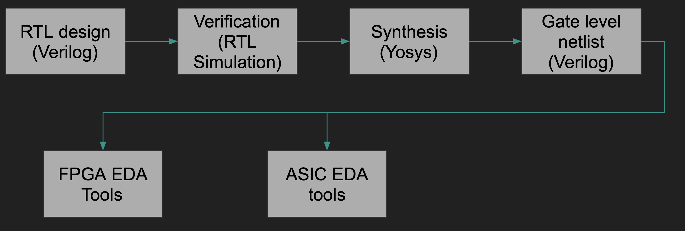
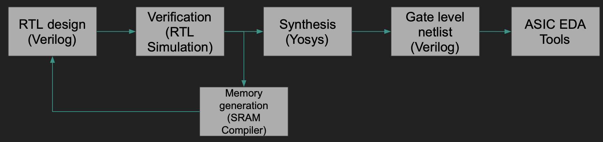
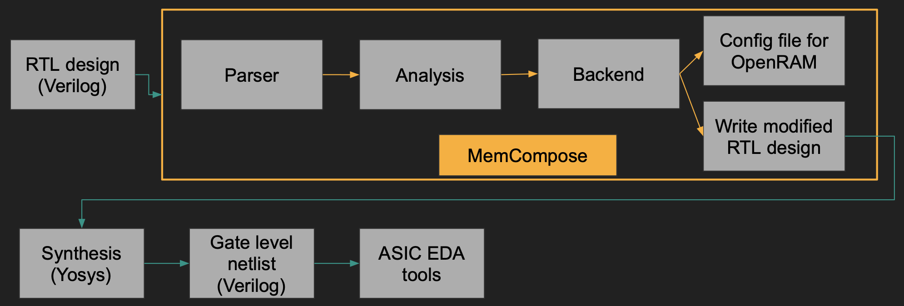

# MemCompose

A tool for automatically replacing 2-D register array declarations defined in Verilog to synchronous memories generated by the OpenRAM compiler  

# TL;DR

The `examples/` folder has the verilog file and the metadata json file required by the tool to generate the verilog. You can do the following to run the built-in examples:

```bash
python3 memcompose.py -t <module_name> -j examples/<memory_type>/metadata.json examples/<memory_type>/<memory_type>.v
```

For example:

```bash
python3 memcompose.py -t singleport_1rw -j examples/singleport_1rw/metadata.json examples/singleport_1rw/singleport_1rw.v
```
# Introduction
MemCompose was made as part of the final project of CSE 211. This tool is a memory synthesis compiler that automates the memory synthesis for ASIC backend.
Since this project is more hardware oriented a brief background is presented to be able to comprehend what problem is being solved.
# Background
The traditional hardware design flow roughly follows the following diagram:



The hardware logic is usually written in a hardware description language named Verilog. This logic modeled in Verilog is generally called Register-Transfer Level (RTL). Like any other software project, once the hardware is modeled it is verified using testbenches to make sure it performs its intended behavior. After verification, the RTL is provided to a synthesizer to transform higher level constructs written in Verilog to actual gates and flip-flops. It is the job of the synthesizer to take a higher abstraction of logic and transform it to low-level Verilog with only gates also known as gate-level netlis. In the above diagram a tool called Yosys is mentioned which is an open-source synthesis tool. The gate-level netlist is then passed on to either FPGA based Electronic Design Automation (EDA) tools or ASIC based EDA tools depending upon the backend target.

# Problem Statement
Most of the hardware design requires some kind of memories to store certain data. In Verilog memories are generally declared as 2-D register arrays like:

```verilog
reg [15:0] RAM [1023:0];
```
The above syntax indicates a memory with 16 bit word size and a depth of 1024 rows. For the FPGA backend Yosys supports directly mapping these memory declarations to efficient Block RAMs (BRAMs) available on the FPGAs. This saves the time of the RTL designer as they don't have to think about porting their 2-D register array declarations on each FPGA. In short Yosys offers portability to the front-end designer. 

Unfortunately, this automatic mapping is not available on the ASIC backend. The ASIC backend flow involves manually compiling the SRAMs by an SRAM compiler and instantiating the generated verilog file inside your design. The flow diagram for an ASIC backend is shown below.



This increases the time spent on the design entry stage since the designers have to call the SRAM compiler, pass in the parameters such as the word size, depth, and the number of ports and instantiate the generated verilog in their design. This causes the following problems:
*  Increase in the time spent on verification since the          verification needs to be re-done with the new SRAM models. 

* Susceptible to the designer's mistake of not choosing efficient memory parameters for the task.

Compilers are known to automate and optimize such tasks. Moreover, Yosys already doing this mapping for FPGA backends further proves this problem to be automatable.

# How can we solve it?

We can use compiler techniques to parse the memory declarations in the verilog, do some analysis of the Abstract Syntax Tree (AST) and generate a configuration file for an open-source memory compiler framework OpenRAM. We can then instantiate the memory instance inside the verilog.

## MemCompose to the rescue

MemCompose essentially does the above. It is composed of three components:

1. Parser
2. Analysis
3. Backend

Below is the flow of memory synthesis with MemCompose:



### Parser
MemCompose uses PyVerilog as a front-end parser to create an AST of the RTL design. It then extracts various important features like the memory declarations, port names, and module name to be able to later generate the verilog file with the memory instantiated. 

### Analysis
The analysis is done on the dataflow graph generated from the RTL design. This provides binding mappings to the memory. Analysis is done on these bindings to infer the read/write ports of the memory. 

### Backend
The backend is then used to write two different files. One is the modified RTL design with the memory instantiated inside it and the other is the configuration file that can be provided as input to the OpenRAM compiler for generating the memory.

# Quick Memory Primer
Before we see MemCompose working let's do a quick primer on the port types of memory and an example of how one looks in Verilog. Generally the most common memory port types supported by FPGA toolchains are:

1. Single-port 1RW (1 read or write) memory
2. Dual-port 1R1W (1 read, and 1 write) memory
3. Dual-port 1RW1R (1 read or write, and 1 read) memory
4. Dual-port 1RW1W (1 read or write, and 1 write) memory
5. Dual-port 2RW (2 read or write) memory

An example of how a single port 1RW memory in Verilog might look like is the following:

```verilog
module singleport_1rw (
    input clk,
    input we,
    input en,
    input [9:0] addr,
    input [15:0] di,
    output [15:0] dout
    );

    reg [15:0] RAM [1023:0];
    reg [15:0] dout;

    always @(posedge clk) begin
        if (en) begin
            if (we)
		RAM[addr] <= di;
	    else
		dout <= RAM[addr];
	end
    end
endmodule
```

Notice how there is just one port each for `addr`, `di` and `dout` signals used for address to the memory, data input to the memory, and data output from the memory. A single write enable `we` signal control whether to write to the memory or read from the memory. Let's take one more example of how a dual-port 1RW1R memory looks like in Verilog.

```verilog
module dualport_1rw1r (
    input  clka,
	input clkb,
	input ena,
	input enb,
	input wea,
    input  [5:0]  addra,
    input [5:0] addrb,
    input  [15:0] dia,
    output [15:0] doa,
	output [15:0] dob
	);
    reg    [15:0] ram [63:0];
    reg    [15:0] doa,dob;

    always @(posedge clka) begin
        if (ena)
        begin
            if (wea)
                ram[addra] <= dia;
            doa <= ram[addra];
	end 
    end
    always @(posedge clkb) begin
        if (enb) begin
            dob <= ram[addrb];
	end 
    end
endmodule
```

Notice how we have two ports for the address signals (`addra`, `addrb`), two ports for data output (`doa`, `dob`), two ports for the clock (`clka`, `clkb`) and two ports for the chip enable signals (`ena`, `enb`). If you look at the first `always` block clocked with `clka`:

```verilog
always @(posedge clka) begin
    if (ena) begin
        if (wea)
            ram[addra] <= dia;
        doa <= ram[addra];
    end 
end
```
This block acts as a 1RW port where data is written when `wea` is asserted and data is always read out from `doa` port. The second always block mimics the 1R port:

```verilog
always @(posedge clkb) begin
    if (enb) begin
        dob <= ram[addrb];
    end 
end
```
It always reads data out on the `dob` port. To further look on other memories check the `examples/` folder. With some background on how memories are declared in Verilog let's look at how MemCompose works with them. 

# Running MemCompose
When given these memory files as input to MemCompose, it does the parsing, analysis and backend generation. The final output from the backend generation are two files:

1. OpenRAM configuration file
2. New Verilog RTL file with memory instantiated

Let's look at how MemCompose would genearte the OpenRAM configuration file by taking the single-port memory as an example.

We run the following command:
```bash
python3 memcompose.py -t singleport_1rw -j examples/singleport_1rw/metadata.json examples/singleport_1rw/singleport_1rw.v
```

Ignore the `-j` flag followed by the `metadata.json` file for now. It generates the configuration file by the name `singleport_1rw.py`. These are the contents of the configuration file:

```python
# this file is created by MemCompose - Muhammad Hadir Khan
# data word size 
word_size = 16
# num of words 
num_words = 1024
num_rw_ports = 1
num_w_ports = 0
num_r_ports = 0
# Technology to use in $OPENRAM_TECH 
tech_name = 'scn4m_subm' 
nominal_corner_only = True 
output_path = 'temp' 
output_name = 'sram_16_1024_scn4m_subm'
```

We can see it correctly generates the parameters like `word_size`, `num_words`, `num_rw_ports`, `num_w_ports`, and `num_r_ports` required by OpenRAM. The `tech_name` for now is fixed to `scn4m_subm` but later support for other PDKs can be added. The `output_name` of the memory that will be generated by OpenRAM is also produced according to the `word_size`, `num_words` and `tech_name` parameters. Later, running the OpenRAM (follow the readme here: https://github.com/VLSIDA/OpenRAM) and passing in this configuration file generates the behavioral model of memory as follows:

```verilog
module sram_16_1024_scn4m_subm(
`ifdef USE_POWER_PINS
    vdd,
    gnd,
`endif
// Port 0: RW
    clk0,csb0,web0,addr0,din0,dout0
  );
  parameter DATA_WIDTH = 16 ;
  parameter ADDR_WIDTH = 10 ;
  parameter RAM_DEPTH = 1 << ADDR_WIDTH;
  // FIXME: This delay is arbitrary.
  parameter DELAY = 3 ;
  parameter VERBOSE = 1 ; //Set to 0 to only display warnings
  parameter T_HOLD = 1 ; //Delay to hold dout value after posedge. Value is arbitrary

  `ifdef USE_POWER_PINS
        inout vdd;
        inout gnd;
  `endif
  input  clk0; // clock
  input   csb0; // active low chip select
  input  web0; // active low write control
  input [ADDR_WIDTH-1:0]  addr0;
  input [DATA_WIDTH-1:0]  din0;
  output [DATA_WIDTH-1:0] dout0;
  .
  .
  .
```
We don't need to go into the details of this file. We will believe that OpenRAM generates the correct behavorial model of the memory. However, we will see that the other file that MemCompose writes which is the genearted Verilog file has this memory instantiated inside it. Let's look at the generated Verilog file which is basically the modified version of the input single-port memory file from above. This file is generated with the name `singleport_1rw_generated.v`. 

```verilog
module singleport_1rw
(
  input clk,
  input we,
  input en,
  input [9:0] addr,
  input [15:0] di,
  output [15:0] dout
);

  reg [15:0] dout;
  wire [15:0] dout_wire;

  always @(posedge clk) begin
    dout <= dout_wire;
  end


  sram_16_1024_scn4m_subm
  sram
  (
    .clk0(clk),
    .csb0(~en),
    .addr0(addr),
    .din0(di),
    .dout0(dout_wire),
    .web0(~we)
  );


endmodule
```

Notice how all the `always` blocks that read/write the memory have been removed and instead the memory generated from OpenRAM is instantiated here. We will let OpenRAM's generated behavioral model handle the reads and writes. We just pass the required signals of the module. Also there is an additional `always` block that was not there in our original memory model. 

```verilog
always @(posedge clk) begin
    dout <= dout_wire;
end
```
This block just stores the value read from the memory `dout_wire` into the register `dout` on positive edge of the clock since OpenRAM's model provides output on the negative edge of clock. 

There is one more thing to it, notice the `~` symbol in front of `en` and `we` signals passed to the OpenRAM generated memory instance. We are inverting these signals and this is due to the fact that OpenRAM's behavioral models for memories always assume write enables and chip select to be `active low` but in our case the way we defined the single-port memory behavior above we assumed write enables and chip select to be `active high`. So we need a way to tell MemCompose about this polarity and also which signals are write enables, which signals are clock signals and which signals are used for address and data and so on. Since the compiler itself cannot make sense of them. This is where the `metadata.json` file we passed earlier comes into the picture. Let's look at it now for the single-port memory. It is available in `examples/singleport_1rw/metadata.json`. 

```json
{
    "module_name": "singleport_1rw",
	"ports": [
		{
		    "type": "clock",
			"name": "clk"
		},
		{
		    "type": "chip_select",
			"name": "en",
			"polarity": "active high"
		},
		{
		    "type": "write_en",
			"name": "we",
			"polarity": "active high"
		},
		{
		    "type": "address",
			"name": "addr"
		},
		{
		    "type": "data_in",
			"name": "di"
		},
		{
		    "type": "data_out",
			"name": "dout"
		}
     ]
}

```
This file is required by MemCompose to make sense of the types of the port so that it can connect them correctly with the OpenRAM's generated memory model. Notice how we also declare the polarity of `chip_select` and `write_en` type signals. This helps MemCompose to prepend the inverter `~` symbol to ensure correct behavior. If we would have declared the `polarity` to be `active low` in this metadata file then MemCompose would not have prepended the `~` symbol while connecting the ports to the OpenRAM memory model.

# Conclusion and future work

There are still some stuff that remains unconvered in this report due to the large codebase of MemCompose. It is still pretty early in development and can have quite a lot of bugs. There can be a lot added to this project such as:

1. Add support for other PDKs that OpenRAM support
2. Add support for multi-port memories (more than dual-port)
3. Add support for generating latch-based register files instead of SRAMs

# Citation

This project uses PyVerilog (https://github.com/PyHDI/Pyverilog)

This project generates configuration files for OpenRAM (https://github.com/VLSIDA/OpenRAM)
